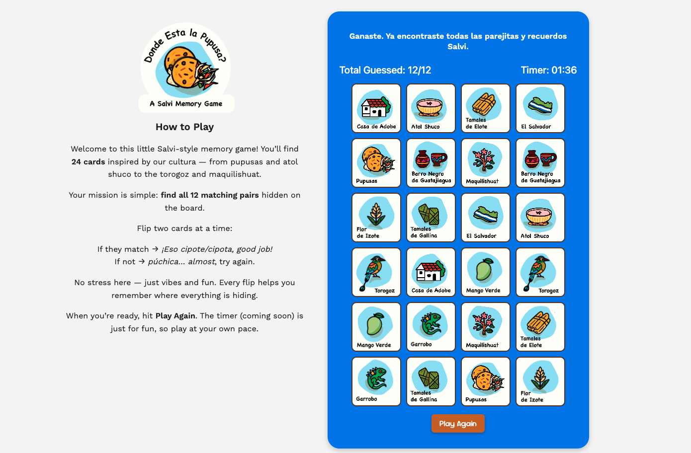

# Dónde Está la Pupusa? – Browser Memory Game

A browser-based memory game inspired by Salvadoran culture.  
Flip cards, find matching pairs, and win before the 2-minute timer runs out.

## Game Preview




## How to Play
- The board contains 24 cards (12 pairs), all face down.
- Click on a card to flip it, then click a second card to try to find its match.
- If the cards match, they remain face up.
- If not, they flip back after a short delay.
- The timer starts automatically when you flip your first card.
- Your goal is to match all 12 pairs before the time limit.

## Win and Lose Conditions
**You win if:**
- You match all 12 pairs before the timer reaches 2 minutes.

**You lose if:**
- The timer reaches 120 seconds, and the board automatically locks.

**After a win or loss:**
- A final message appears at the top of the game panel.
- The board stops accepting clicks.
- The “Play Again” button is displayed.

## Features
- Custom Salvadoran-inspired card artwork (pupusas, maquilishuat, torogoz, tamales, etc.).
- Fully dynamic board built and updated with JavaScript.
- Timer that triggers a lose state at 2 minutes.
- Match counter that updates with every successful pair.
- Random Spanglish messages for matches and mismatches.
- Prevents fast-clicking bugs using a board-lock system.
- Responsive two-column layout using Flexbox.

## Technologies Used
### Development Tools
- HTML  
- CSS  
- JavaScript (DOM manipulation, rendering, state management)

### Design Tools
- Adobe Illustrator – created custom card artwork  
- Figma – UI planning and layout exploration  
- Adobe Express – asset resizing and export optimization

### Version Control & Deployment
- Git  
- GitHub  
- GitHub Pages for hosting

## Project Structure
```
browser-memory-game/
│
├── index.html
├── style.css
├── app.js
├── data.js
├── images/
│     ├── card-back.png
│     ├── pupusa-header.png
│     ├── [12 card images...]
│
└── README.md
```

## How to Run Locally
1. Clone the repository:
   ```
   git clone https://github.com/<your-username>/browser-memory-game.git
   ```
2. Navigate into the folder:
   ```
   cd browser-memory-game
   ```
3. Open `index.html` in a browser or run with VS Code’s Live Server.

## Future Improvements
- Card flip animation
- Sound effects
- Win/lose pop-up modal
- Confetti celebration
- Difficulty modes
- Save best time with localStorage
